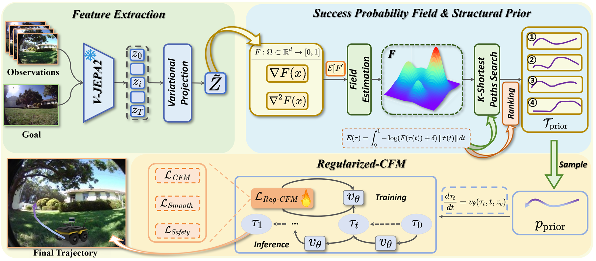

# StepNav: Efficient Planning with Structured Trajectory Priors

[](https://opensource.org/licenses/MIT)
[](https://www.python.org/downloads/release/python-380/)
[](https://pytorch.org/)
[](https://2026.ieee-icra.org/)

**[Project Page](https://luoxubo.github.io/StepNav/)** | **[Paper](https://arxiv.org/abs/2602.02590)** | **[Code](https://github.com/LuoXubo/StepNav)**

> Official PyTorch implementation of **StepNav**, an efficient visual navigation framework accepted at **ICRA 2026**.

## Abstract

We present StepNav, an efficient planning framework for visual navigation that generates reliable trajectories using structured trajectory priors. Unlike existing methods that rely on unstructured noise, StepNav leverages multi-modal trajectory initialization combined with conditional flow matching for efficient and safe path generation.



## Installation

```bash
git clone https://github.com/LuoXubo/StepNav.git
cd StepNav
conda create -n stepnav python=3.8
conda activate stepnav
pip install -r requirements.txt
pip install -e .
```

## Citation

If you find this work useful, please consider citing:

```bibtex
@misc{luo2026stepnavstructuredtrajectorypriors,
      title={StepNav: Structured Trajectory Priors for Efficient and Multimodal Visual Navigation}, 
      author={Xubo Luo and Aodi Wu and Haodong Han and Xue Wan and Wei Zhang and Leizheng Shu and Ruisuo Wang},
      year={2026},
      eprint={2602.02590},
      archivePrefix={arXiv},
      primaryClass={cs.RO},
      url={https://arxiv.org/abs/2602.02590}, 
}
```

## Acknowledgments

This work builds upon [NoMaD](https://github.com/robodhruv/visualnav-transformer), [Flownav](https://github.com/utn-air/flownav), and [NaviBridger](https://github.com/hren20/NaiviBridger).